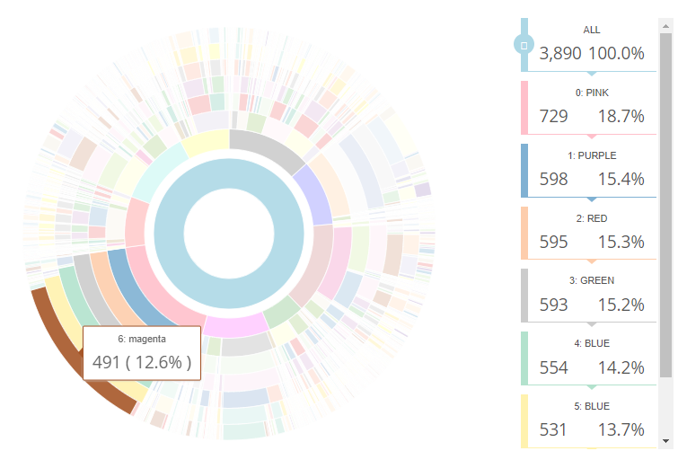
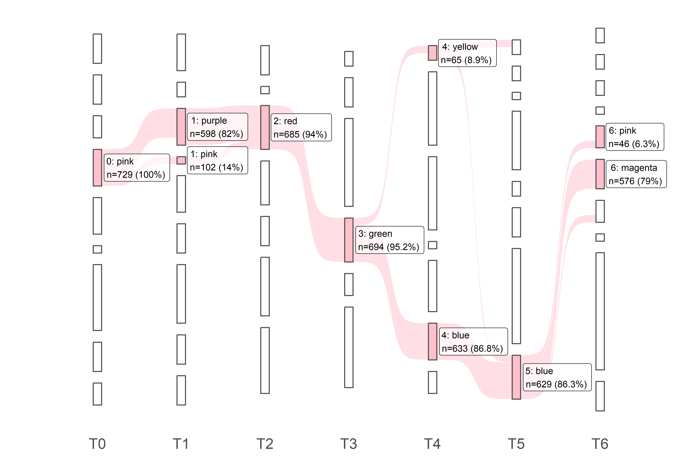
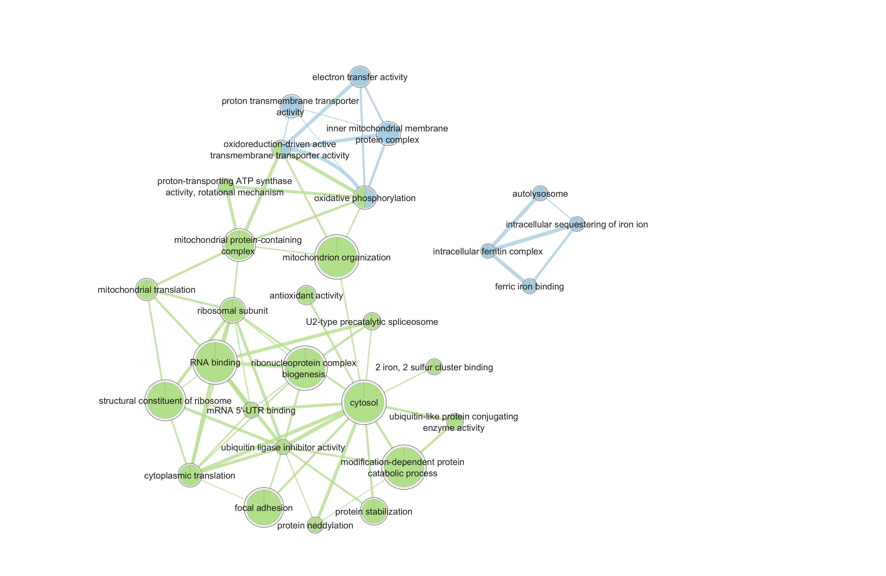

# scCoExpNets

Here, we present a new computational method, scCoExpNets, to create and analyze single-cell gene co-expression networks (GCNs). It is based on the CoExpNets R package, but adapted to single-cell/single-nucleus RNA-seq data. For each cell type, scCoExpNets combat the sparsity of the gene expression matrix by collapsing pairs of cells that come from the same individuals and the same cell type while the number of cells is over a given threshold, thus creating multiple matrices,each one leading to a different GCN. The GCNs created for the same cell type are seen as interlinked and complementary views of the same phenomena. They are interlinked since they share common insights and they are complementary since each one provide new insights. Thanks to the creation of multiple GCNs for each cell type, scCoExpNets identifies modules found in many GCNs simultaneously, that are robust to sparsity, and hence biologically credible, as well as modules that evolve across expression matrices, leading to potentially new interesting modules. In the paper, we show that creating GCNs from pseudo-cells expression matrices increases, specializes and completes the biological insights of the GCN created from the original and highly sparse expression matrix. We applied this new tool on a single-nucleus RNA-seq dataset of human post-mortem substantia nigra pars compacta tissue of 13 controls and 14 Parkinson’s disease (PD) cases. In this scenario, scCoExpNets was used to identify a Parkinson-relevant module of one of the most relevant cell types for Parkinson, dopaminergic neurons. This module, quite robust to sparsity and replicated in an independent cohort was enriched with ferroptosis suppressors, suggesting that ferroptosis is disrupted in PD DNs.


scCoExpNets is an easy-to-use package that contains all the functionalities to manage multiple GCNs at the same time, including new ways to annotate the modules (custom gene set enrichment analysis), new ways to visualize them (sunburst, sankey plot, enrichment map) and automatic detection of interesting modules (custom criteria). 


{width=250}
{width=150}
{width=100}

## Installation

Recommended that you install first CoExpNets package like so:

``` r
devtools::install_github('juanbot/CoExpNets')
```

You can install the development version of scCoExpNets like so:

``` r
devtools::install_github('aliciagp/scCoExpNets')
```


## Credits

The development of this package has been possible under the supervision of Juan A. Botía from the University of Murcia and Sebastian Guelfi and many collaborators from Verge Genomics.


